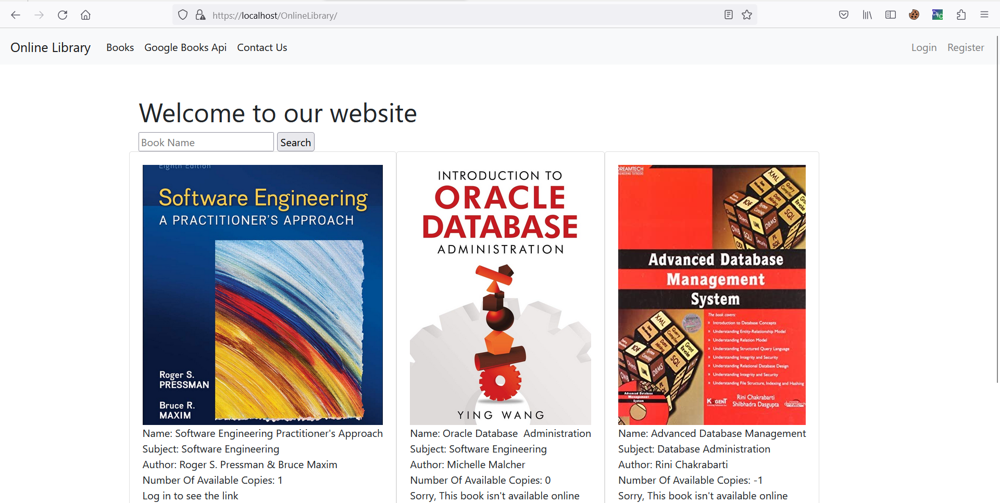
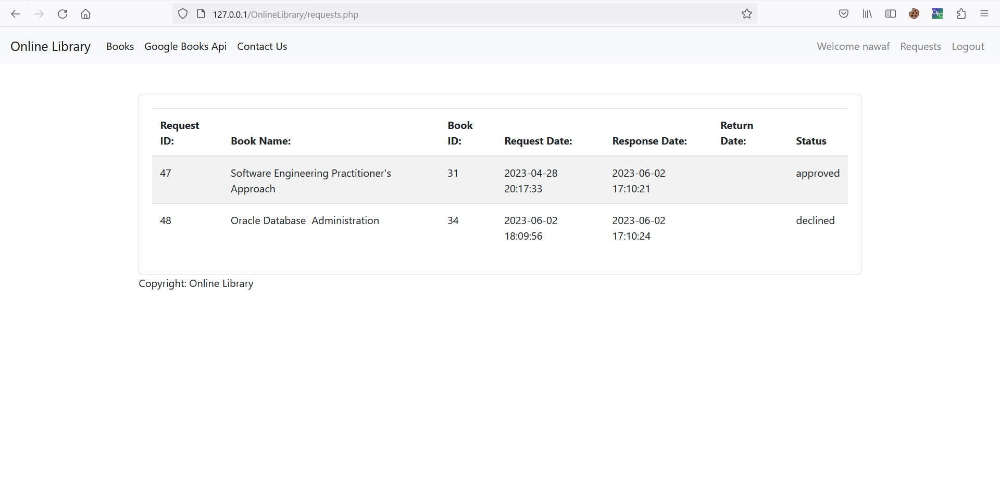
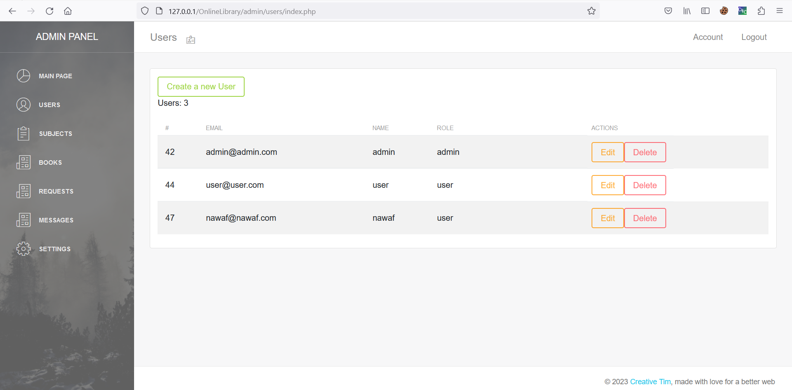
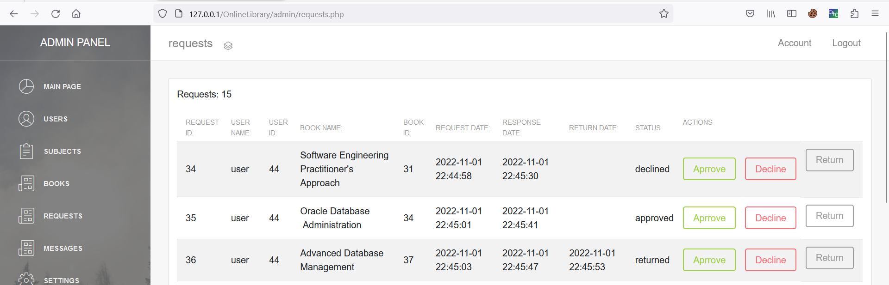
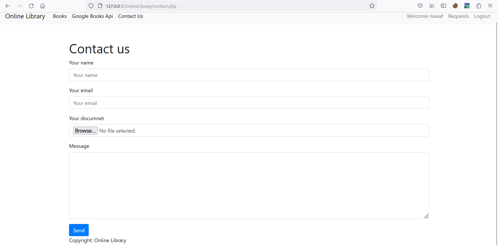

# OnlineLibrary

## Project Description

The Online Library Management System aims to provide a seamless and efficient experience for both library owners and patrons. By automating the borrowing process, tracking book availability, and facilitating online reading, the system simplifies book management and enhances user satisfaction. Whether users want to borrow physical books or access digital copies, this platform offers a user-friendly interface and comprehensive features to meet their needs.

## Pages and Interfaces

The project contains the following pages and interfaces:

### Index.php (Without Login)

This is the landing page of the project for users who are not logged in. 

### Index.php (After Login)

This is the landing page of the project for users who have logged in.

### Requests.php (For Users)

This page allows logged-in users to view and manage their requests. It display a list of submitted requests,time and their status.

### Admin Panel (User Control)

The admin panel allows administrators to manage user accounts. It provides features such as editing user profiles and deleting user accounts.

### Admin Panel (Request Management)

The admin panel also includes a section for managing requests. Administrators can view all requests, change their status, and take actions such as approving or rejecting requests.

### Contact Us Page

The contact us page provides a form  for users to get in touch with the project team. It include fields for name, email, subject, and message.

